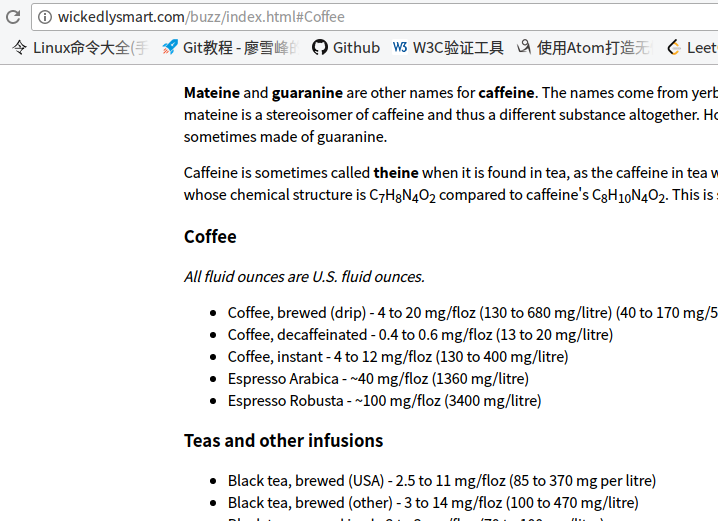

# HTML & CSS

date: 2017-11-28

author: dreamgqk

-----

## HTML

1. 什么是HTML?

    HTML(HyperText Markup Language)超文本标记语言，注意两个关键字，一个是**超文本**，一个**是标记**。

    1.1 标记。

    所谓**标记**，就是HTML用来“标示”文本的工具。因为我们希望给用户看到的不是一些干巴巴的文字，而是一些有层次有结构感的文字集合。比如我们会在word里用各种排版来写文章，其实说白了word就是一种所见即所得模式，编辑的时候看到的那些标题段落等，就是我最后呈现出来的。HTML按照我的理解就是利用这些标记来标示那些排版（这里只是说结构，不涉及到文本样式），比如标题的话用可以这样：

    ```html
    <h1>Welcome to the Head First Lounge</h1>
    ```

    就会显示成这样:

    

    这里只是为了想突出标题和别的段落的区别，主要是因为`<h1>`标签产生了这样的效果，事实上这里还加入了一点css做了些样式的调整。总的来说，标记就是能让你告诉浏览器你的html的结构是什么样的，哪里是标题，哪里是段落，哪里是引用，哪里需要被强调等等信息，然后浏览器会根据你给的标签按照所规定好的样式进行显示（这个样式有两种来源，一种是你什么都没做，由浏览器决定默认显示的样式，另一种是你自己写css规定）。

    观察上面那个标签，可以看到有一个开始标签、结束标签和内容。这是一种，还有一种void标签，他没有内容，那么自然也就不用结束标签。比如``。

    还有一点，标签是可以具有属性的，属性是一个键值对。后面有示例。

    1.2 超文本。

    另一个关键字，**超文本**，我查了下[百度百科](https://baike.baidu.com/item/HTML/97049?fr=aladdin)，里面对超文本是这么解释的：

    >“超文本”就是指页面内可以包含图片、链接，甚至音乐、程序等非文字元素。

    其实我个人并不是很认同这样的说法，程序我不敢说，因为我还没学到脚本程序，但图片我觉得其实并没有包含进来，它只是利用链接指向了那个图片资源，事实上浏览器再解析到这里时还需要根据src再发一次申请图片的请求，不过也许这也能理解为一种“包含”吧（但如果图片资源已经不在那个路径了呢？申请失败还能叫包含吗？）

    我觉得超文本核心其实体现在**链接**。链接就是某个资源的地址，通过这个地址可以找到那个资源，地址可以是绝对地址、相对地址和url（我习惯把这3个分开说）。主要是靠`<a>`标签，图像资源用。下面举个例子：

    ```html
    <p>
        You'll find us right in the center of downtown Webville. If you need
        help finding us, check out our
        <a href="about/directions.html">detailed directions.</a>
        Come join us!
    </p>
    ```

    显示的效果如下：

    

    点击那个蓝色有下划线的部分后，当然前提是地址和资源对应起来：

    

    在我看来html主要的核心其实就是这两个概念，其他的就是关于一些常用标签的记忆和熟悉，当然还要尽量符合**HTML5标准**。

2. 已学的标签：

    先举一个例子(贴出刚刚那个完整的html文件)：

    ```html
    <!DOCTYPE html>
    <html>

    <head>
        <meta charset="utf-8">
        <title>Head First Lounge</title>
        <link rel="stylesheet" href="lounge.css">
    </head>

    <body>
        <h1>Welcome to the Head First Lounge</h1>
        
        <p>
            Join us any evening for refreshing <a href="beverages/elixir.html">elixirs</a>, conversation and maybe a game or two of
            <em>Dance Dance Revolution</em>. Wireless access is always provided; BYOWS (Bring your own web server).
        </p>
        <h2>Directions</h2>
        <p>
            You'll find us right in the center of downtown Webville. If you need
            help finding us, check out our
            <a href="about/directions.html" title="directions">detailed directions.</a>
            Come join us!
        </p>
    </body>

    </html>

    ```

    再看一次显示效果：

    

    - `<!DOCTYPE html>`(或者`<!doctype html>`)告诉浏览器你使用HTML5标准，如果用XHTML或HTML4.01也有别的相应的写法。

    - `<html>`，每个html文件都要有的一个标签，它是根(整个html文件可以看成一棵文档树，每个节点都是一个标签)。

    - `<head>`，也是必备的一个标签，用来包含一些网页必要的信息(信息来自它的子标签)。比如`<meta>`包含html所用的字符集，应用如下：

        `<meta charset='utf-8'>`

        你可能看到旧版本的HTML中的`<meta>`会有更多的东西，但在HTML5标准中这是合法的。

        顺便说一下`<title>`。`<title>`的内容是显示在浏览器窗口上的那个名字。`<link>`比较重要，等会再说。

    - `<body>`，它的内容就是我们平常在网页上所看到的那些内容。即网页的主体。

    - `<h1>`标签表示标题，最大的那个，一共有6个，从`<h1>`到`<h6>`，逐渐变小。

    - ``标签是一个void标签，属性`src`是图片的路径，还有一个必须的属性`alt`，当图片无法正常显示的时候就会显示alt的文本。

    - `<p>`标签用的非常多，它表示一个段落。

    - `<a>`如前面所说，表示链接，`href`的值是路径，顺便补充一个`title`属性，当把鼠标移动到内容上时会显示一个方框，里面是它的值。如下（其实鼠标在上面，只是截图截不到鼠标）：

        

        同时`<a>`标签还有一个强大之处在于它不仅可以连接到某个网页，甚至可以具体到网页的某个位置（一般没有特别要求都会从top开始），怎么做，这就需要被链接的网页的那个你希望到达位置的标签有一个特殊属性`id`。

        `id`是唯一可以用来标识某个标签的属性。举个例子，比如说我的网页想链接到另一个网页的Coffee那个位置（网页中的某个位置）。

        

        通过审查元素我发现这个标签的`id`为"Coffee"：

        

        然后我的网页中`<a>`标签可以这么写：

        ```html
        <a target="_blank"
            href="http://wickedlysmart.com/buzz/index.html#Coffee">
            Caffeine Buzz
        </a>
        ```

        重点在href后面，在url的最后添加了一个`#Coffee`，#表示查找，它会让你的链接定位到`id`=`Coffee`的标签。

        当我点击了这个链接，直接到达Coffee:

        

        然后上面那个`<a>`又引出了一个属性......`target`表示新产生的窗口，即不会覆盖原网页（不设置这个属性默认是覆盖），比如刚刚那个链接点了之后会发现产生的是新的窗口：

        

        是的，值是`_blank`表示产生一个新的窗口，也可以给窗口命名，比如`targer="haha"`，这样的话，如果别的链接或网页也是用的"haha"窗口依然会发生覆盖。

    - `<em>`和`<strong>`标签用来强调文本，前者是斜体，后者是加粗，当然样式是可以定制的。

    - `<q>`标签和`<blockquote>`标签都用来引用，前者是短引用，后者是长引用。

    - `<li>`元素表示列表元素，`<li>`必须嵌在`<ol>`和`<ul>`中，前者表示有序列表，后者是无序列表。

    常用的就这么些，还有几十种标签，都在w3c上可以用到的时候查。顺便补充：标签是分为两类的，一种是块元素，一种是内联元素。区别是前者自成一段，前后会有换行符，后者是嵌在别的元素里的，当然某些元素同时具有这两者的特性（比如`<a>`）。

## CSS

1. 什么是CSS？

    CSS(Cascading Style Sheet, 层叠样式表)，用来表现html的语言。早期的html把结构和样式都用html一个语言来写，使得写网页变得很复杂，后来人们把结构和样式分开，用html写结构，用CSS写样式。

2. 怎么写CSS?

    > Talk is cheap, show me the code.

    CSS可以直接嵌在html文件中，它通常放在`<head>`标签的子标签`<style>`中。比如：

    ```html
    <head>
        <meta charset="utf-8">
        <title>Head First Lounge Elixirs</title>
        <style>
            body {
                font-family: sans-serif;
            }

            h1, h2 {
                color: gray;
            }

            h1 {
                border-bottom: 1px solid black;
            }

            p {
                color: maroon;
            }

            .greentea {
                color: green;
            }

            .raspberry {
                color: blue;
            }

            .blueberry {
                color: purple;
            }
        </style>
    </head>
    ```

    效果图(这里就不要纠结好不好看了，只是为了展示)：

    

    可以看到它位于`<style>`标签中，这里只是展示个代码，后面具体说每个部分代表什么。

    这里可能会带来什么问题？
    - 太长了代码不好看啊。
    - 我要是别的文件也想用这个样式表那还得一个个复制？万一出错或者哪天相统一修改了那不GG？<br><br>

    其实这两个问题很简单就能解决，太长了弄成一个文件呗，从通用性角度考虑这么做也很合适，就像C/C++那些语言的头文件一样，哪个文件想用的时候直接"include"就ok了，那么对于html文件来说，怎么来表示"include"呢？就是前面看到的一直没说的`<link>`标签。

    步骤很简单：首先把`<style>`标签中的内容全部放到一个文件里(后缀名为.css)，比如我放到lounge.css，然后一条语句换掉整个`<style>`搞定：`<link rel="stylesheet" href="../lounge.css">`，`href`的值就是lounge.css的路径，`rel`表示这是一个样式表，记住它是必备的就好。

3. CSS具体的语法（至今为止掌握的）

    3.1 从简单例子开始。

    拿一个刚刚举的例子中的一个出来说：

    ```css
    body {
        font-family: sans-serif;
        color: gray;
    }
    ```

    主要由3部分组成，`body`那个部分是针对所要表现的标签的名字，即我要对`<body>`进行表现，可以把这看成是一种选择，所以在CSS里，它是选择器的名字，比如这一小段就是body选择器。每一个选择器都代表了一个（表现）规则。

    然后又是熟悉的键值对，Key表示属性，即针对什么进行定制，value就是值，定制为什么样子。这里的`font-family: sans-serif;`就表示字体属定制为 sans-serif 字体。`color: gray;`表示字体颜色为gray。

    3.2 进一步讲。

    注意到之前给的CSS代码里有一个：

    ```css
    h1, h2 {
        color: gray;
    }
    ```

    发现选择器并不只是一个标签，而可以是多个标签，没错，多个标签如果你希望具有相同的样式可以归为一个选择器。这通常放一些标签共有的一部分属性，如果还希望某个标签具有附加特别的属性可以继续写一个关于这个标签的选择器。

    另外补充一点，这个选择器什么都没有附加，它会对文档树里几乎所有的`<h1>`和`<h2>`标签都进行相同的表现。为什么说几乎，因为你可以对某些特定的标签进行表现。怎么让标签特定化？

    3.3 让标签特定化。

    每个标签都可以添加一个`class`属性，把这个标签归为某个类，*值得注意的一点是一个标签可以有多个`class`（放在一个双引号内，每个类用空格分开），而一个类里面可以包含多个标签*。实例：

    ```html
    <p class="greentea">
        
        Chock full of vitamins and minerals, this elixir combines the healthful
        benefits of green tea with a twist of chamomile blossoms and ginger root.
    </p>
    <h2>Raspberry Ice Concentration</h2>
    <p class="raspberry">
        
        Combining raspberry juice with lemon grass, citrus peel and rosehips,
        this icy drink will make your mind feel clear and crisp.
    </p>
    <h2>Blueberry Bliss Elixir</h2>
    <p class="blueberry greentea">
        
        Blueberries and cherry essence mixed into a base of elderflower herb tea
        will put you in a relaxed state of bliss in no time.
    </p>
    <h2>Cranberry Antioxidant Blast</h2>
    <p>
        
        Wake up to the flavors of cranberry and hibiscus in this vitamin C rich
        elixir.
    </p>
    ```

    这里有4种`class`的`<p>`标签，不同类的标签可以看做是不同的，这样就使得这些标签更特定化了，那么CSS怎么去写他们的选择器？有很多方法：

    - 最特定的方法：

    ```css
    p.greentea {
        color: green;
    }
    ```

    - 如果希望同一个类采用相同的样式：

    ```css
    .greentea {
        color: green;
    }
    ```

    可是这会带来一个问题：如果有一个p选择器，p.greentea选择器，.greentea选择器，更夸张一点，p标签是有多个class的，而不巧的是依然有这写个选择器（一首凉凉...），造成冲突了，怎么解决？

    3.4 继承。

    接下来来看一下什么是继承...(PS：这个不是解决冲突，是还有一种冲突情况没讲...)

    最开始的例子是body选择器，对于某些属性（比如`font-family`属性）是可以被它的子标签继承的。所以body下的所有能有`font-family`属性的标签都会采取这个样式。注意不是所有属性都能继承，比如添加边框等属性（可能只希望body有边框，但不需要所有的子标签都有边框）。

    这时候就很显然了，这又是一种冲突情况，问题变得更加复杂了。

    3.5 解决冲突。

    冲突的解决方案基于两个原则：

    - 特定级高的优先。
    - 相同特定级在CSS定义的选择器中最靠后的优先。

    关于特定级（按照我自己的理解）：

    继承的选择器 < 自己标签的选择器 < 粗略类选择器(`.greentea`这种) < 更特定的类选择器(`p.greentea`这种)。

    如果没有比某个选择器更特定的，且同级别的适合该标签的选择器有多个（比如一个标签具有多个类），则选择最后一个定义的选择器（即在css定义中最靠后的位置）。

## 特别补充的内容

1. 验证HTML是否符合HTML5标准可以上[https://validator.w3.org/](https://validator.w3.org/)。
2. 验证css是否正确可以上[http://jigsaw.w3.org/css-validator/](http://jigsaw.w3.org/css-validator/)。
3. 在第4章需要把HTML文件传上服务器的时候，自己买了腾讯云的服务器进行搭建，域名是 dreamgqk.cn 。目前还没有搭建好网站，只搭建了一个ftp服务器，用来把本地的文件传上云服务器。（明天腾讯大老爷就把幕布寄过来我就可以完成备案的最后一步了...）
