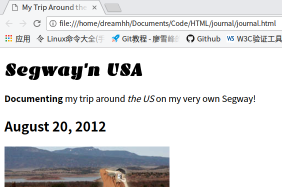

# CSS的一些属性

date: 2017-11-30

author: dreamgqk

-----

昨天一天忙着做数据结构的题。没有学到太多css的知识，这里补充一点之前没具体说的css的一些属性。

1. `font-family`:

    `font-family`的本质是字体优先列表，首先要了解字体系列，注意它们并不是真正的字体，共有5种：

    `font-family`| 字体特点
    -------------|-------
    `Serif`|包括有衬线的字体，看起来很高雅、传统，一般新闻报纸的文字排版用这种字体，这是默认的字体系列。
    `Sans-serif`|取消掉衬线，外观清晰，可读性好，一般认为显示在计算机屏幕上这种字体更识读。
    `Monospace`|每个字宽度相同，看起来像打字机打出来的，例如 'i' 和 'm' 的宽度会相同，主要用于显示代码示例。
    `Cursive`|看似手写的字体，有时用在标题中。
    `Fantasy`|具有某种风格的字体，它和`Cursive`给人一种很有趣或很有风格的感觉。

    ##### 用一个例子说明CSS如何指定字体:

    ```css
    body {
        font-family: Verdana, Geneva, Arial, sans-serif;
    }
    ```

    ##### 需要注意的几点：

    - `font-family`可以指定多个字体，只需要输入这些字体名，并且用逗号分隔。
    - 大小写必须严格与规定的字体名一致。
    - 通常指定的候选字体列表要来自同一个字体系列。
    - 最后一个总是放字体系列名，如这里是`sans-serif`。
    - 多个字体构成了字体候选列表，浏览器在解析的时候会根据所给的顺序依次查找计算机是否有这种字体，有了就直接用，没有的继续往下查找，如果都没有找到就会使用浏览器默认的那个字体系列的字体。
    - 如果添加的字体包含多个单词，比如`Courier New`，那么需要加个双引号，比如： `font-family: "Courier New", Courier;`

    <br>

    关于选择字体，这里针对的是如何确保每个用户的电脑上都有你所用的字体，第一种可靠的策略就是创建一个字体列表，其中包含最适合你的页面的字体，同时考虑用户所用到的操作系统（比如Linux、移动设备）而选择不同的字体，最后再提供一个字体系列来，我们再回头分析那个例子：

    - `Verdana`是我们希望所使用的字体，所以我们放在第一位。
    - 如果没有上面的字体，那么就是用`Geneva`，这个字体是对Mac用户的，因为它可能只有Mac上才有。
    - `Arial`是基本大部分Windows和Mac上有的。
    - 最后如果上面的都没有，就交给用户的浏览器提供它所默认的`sans-serif`系列的一个字体。

    <br>

    如果你确实希望用户使用你所希望的某个字体呢？思路也非常简单，把web字体文件(.woff后缀，Web open font format，wen开放字体格式)放到自己的服务器上，在发送给客户端，或者利用托管服务(Google有免费的字体托管服务，听说国内被墙了，但我测试貌似可以，可以尝试一下[Google Fonts](https://fonts.google.com/)) 。那么可以用Web字体(**Web Font**)，这就需要用到CSS一个比较新的特性：`facefont`规则。（以下的内容可能说的不完全适合，如果你忘记了就翻一下Head First HTML&CSS 的p325，里面的步骤很详细。因为Head First的作者是老外，所以考虑到咱们的国情，可以参考这个网站对国内网络字体的解决方案：[*迟到的中文WebFont*](https://segmentfault.com/a/1190000002519249)）

    #####下面说一下具体的步骤：

    ###### Step1：找到一个字体

    现在有很多提供字体的网站，国外的比如[Google Fonts](https://fonts.google.com/)、[Fonts.com](https://www.fonts.com/web-fonts)和[Extensis](https://www.extensis.com/)。（校园网貌似可以上，其他的未知。）

    ###### Step2：确保有所需字体的所有格式

    到现在为止存储字体使用的具体格式还不是一个标准（逐渐走向标准），不用的浏览器对很多不同的格式提供不同程度的支持：

    (1). TrueType字体(.ttf): 在所有浏览器上都得到了很好的支持，除了IE。

    (2). OpenType字体(.otf)：它是建立在TrueType基础上的。

    (3). Embedded OpenType字体(.eot)：它是OpenType的一种压缩形式。这种格式是Microsoft专用的，仅IE支持。

    (4). SVG字体(.svg)：通用图像格式，通常使用这种格式表示字符。

    (5). Web开放字体格式(.woff)：建立TrueType基础上，已经发展为Web字体的一个标准。

    ###### Step3：把字体文件放到Web上。

    有两种方式，一种是放到自己的Web服务器上，一种是用托管服务。总之要有字体文件的url，本地测试的话本地地址也可以。

    ###### Step4：在CSS中添加`@font-face`属性

    代码如下，当然我只是本地测试这么做，其实可以用托管好的或者在服务器上的：

    ```css
    @font-face {
        font-family: "Emblema One";
        src: url("fonts/EmblemaOne-Regular.ttf");
    }
    ```

    ###### Step5：在CSS中使用`font-family`名

    ```css
    h1 {
        font-family: "Emblema One", sans-serif;
    }
    ```

    ###### Step6：加载页面

    效果如下：

    

    一个`@font-face`只能创建一个字体，因此如果有多个每一个都要独立定义，如果过多的话就需要更多的时间加载（真的很慢）。

    另外我把一个中文字体和该字体文件放到服务器上，在根目录下的font/文件夹里。

2. `color`

    这里只是粗略的描述一下刚看到的几个属性，后面会学习。

    `color`|字体颜色
    -------|-------
    `grey`|灰
    `maroon`|红
    `blue`|蓝
    `green`|绿
    `purple`|紫

3. `font-size`

    ##### `font-size` 用来控制字体大小。4种用法：

    - `font-size: 14px;`：`px`必须紧跟在像素数后面。`14px`指定的是字体的像素高。

    - `font-size: 150%;`：`150%`指定的是相对另一个字体的大小。相对谁呢？相对父标签的字体大小，如果没有父标签则相对默认字体大小。例如：

        ```css
        body { font-size: 14px; }
        h1 { font-size: 150%; }
        ```

    - `font-size: 1.2em;`：类似于`%`，但这里表示是父标签字体的1.2倍。
    - `font-size: small;`：用关键字指定字体的大小，它会使用浏览器的默认值，有这几种关键字：`xx-small`、`x-samll`、`small`、`medium`、`large`、`x-large`、`xx-large`。后一个是前一个的1.2倍。

    ##### 关于指定字体的常用方法：

    (1). 选择一个关键字，一般用`small`或`medium`，指定它作为`body`中的字体大小，用浏览器的默认字体大小。

    (2). 使用em或百分数，相对于body字体大小指定其他元素的字体大小。

    这样的好处在于，如果用户利用浏览器调整字体的大小，页面上的所有字体都会自动调整大小。比如：

    ```css
    body { font-size: small; }
    h1 { font-size: 150%; }
    h2 { font-size: 120%; }
    ```

    一般来讲，`<h1>`是默认文本字体大小的200%，`<h2>`150%，`<h3>`120%，`<h4>`100%，`<h5>`90%，`<h6>`60%。

5. `font-weight`

    `font-weight`| 用来影响字体的粗细。
    -------------|----------------
    `lighter`|字体会淡一点，虽然我个人看不出来和`normal`有多大差别
    `normal`|正常的显示，如果该标签继承了`bold`则可以用这个让它恢复。
    `bold`|加粗
    `bolder`|加的更粗，虽然我同样看不出来和`bold`的差别。

6. `text-decoration`

    `text-decoration`|可以对文本添加一些装饰
    -----------------|------------------
    `none`|什么都没有
    `underline`|下划线
    `overline`|上划线
    `line-through`|删除线

7. `border-xxx` 这不是一个具体的属性，多个属性我想放一块说（复习的时候才发现当时不够了解这个属性，不过也不想再修改，后面会有）。

    用法： `border-xxx: 距离的像素 线的类型 线的颜色`

    举例： `border-bottom: 1px solid black`

    关于已知的线的类型：solid(实线)、dotted(点状线)、dashed(虚线)。

    `border-xxx`|添加分割线
    ------------|---------
    `border-bottom`|下分割线
    `border-top`|上分割线
    `border-left`|左分割线
    `border-right`|右分割线

8. `font-style`

    `font-style`|字体风格
    ------------|-------
    `italic`|产生斜体，另外衬线也会稍微弯曲
    `not italic`|与`italic`相对应
    `oblique`|产生倾斜，但衬线不会弯曲
    `not oblique`|与`oblique`相对应

    事实上通常情况下只会用`italic`。
