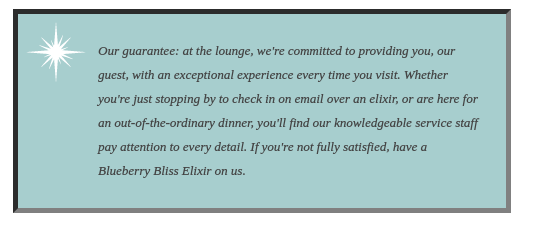
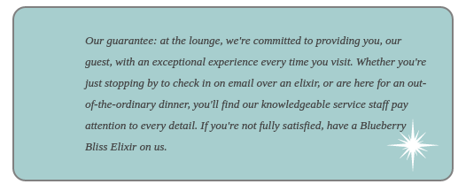

# HTML&CSS学习

date: 2017-12-1

author: dreamgqk

-------

## Web颜色

1. 计算机上如何表达颜色？

    Web颜色是按照构成颜色的红绿蓝(RGB)三个分量所占的指数来决定的。

2. 如何表示颜色？

    有这么几种表示颜色的方法：

    - 按名指定颜色:

        `body { background-color: silver; }`

        CSS的颜色名是不区分大小写的，所以这里`Sliver`、`SLIVER`等都一样。还有一点，即使在最新的浏览器中也只能找到150种颜色，这些颜色名只是预定义了RGB三种颜色的分量。

    - 用RGB的分量表示：

        `body { background-color: rgb(80%, 40%, 0%); }`

        也可以用0-255之间的数值表示：

        `body { background-color: rgb(204, 102, 0); }`

        这种方法的应用也越来越广泛，但目前最流行的还是下面这种。

    - 使用十六进制码指定颜色：

        一个十六进制码中，总以`#`开头，每组2位数字分别代表R、G、B的分量。比如：`#cc6600`（相当于`rgb(204, 102, 0)`）。

    给出颜色表（源自[wiki](https://en.wikipedia.org/wiki/Web_colors#X11_color_names)）：

    

## 盒模型（重要）

### 定义

盒模型是CSS看待元素的一种方式。对于CSS来说，所有的标签（元素）都可以看成是一个盒子，一个盒子包含4部分：**内容区**、**内边距**、**边框**、**外边距**。

#### 1. 内容区

每个元素都会放一些内容（某些特殊的元素除外），比如文字或图片。这个内容会放到一个盒子里，这个盒子的大小正好能容纳所有内容，内容区中，盒子边缘和内容之间没有空间。

#### 2. 内边距

内边距是在内容区的四周可选的空间，它是透明的，没有颜色也没有自己的装饰。

#### 3. 边框

元素周围可以有一个可选的边框，边框包围内边距，它可以有不同的宽度、颜色和样式。

#### 4. 外边距

外边距与内边距相似，只不过它是在边框的四周，它是用来分隔多个盒子。

### 设置

能对盒模型做的设置有很多，根据设置的对象分为5类：

#### 1. 对盒子设置

对一个盒子来说，内边距、边框、外边距都是可选的，可以做出不同的选择。

#### 2. 对边框设置

可以对边框的线有很多设置比如虚线、实线、颜色、甚至圆角等。

(1). `border-style` 用来设置边框类型，包括有`solid`(实线)、`double`(双线)、`groove`(槽线，使得看起来像是网页上的槽)、`outset`(外凸)、`dotted`(虚线)、`dashed`(破折线)、`inset`(内凹)、`ridge`(脊线)。有一些需要把颜色调的淡一些才能看到效果。下面给出效果图，为了能看出效果，color调为gray，font-size调为5px（多图预警）：

`border-style: solid;`:


`border-style: double;`:


`border-style: groove;`:


`border-style: outset;`:


`border-style: dotted;`:


`border-style: dashed;`:


`border-style: inset;`:



`border-style: ridge;`:


(2). `border-color` 用来设置边框颜色，使用方法就如前面说的Web颜色，比如：

`border-color: #ff0000;`，显示效果如下：


(3). `border-width` 用来设置边框宽度，使用方法和`font-size`一样（即那4种表达）。这里就不再进行赘述。

**这里补充一点，关于这些属性其实可以专门指定某些位置进行单一改变的，比如如果对某个盒子有如下css：**

```css
.guarantee {
    border-color:         gray;
    border-width:         5px;
    border-style:         solid;
    border-top-color:     #ff0000;
    border-bottom-style:  dashed;
    border-left-width:    10px;
}
```

从代码中看到我对顶部颜色、底部风格、左边宽度进行了修改，一般来说就这几个方向以及它们的混合方向：top、bottom、left、right、center。那么就会产生这样的效果：


**还有一点非常值得注意，就是如果你对某个特定位置的属性进行修改的时候，必须放在对总体指定的后面，比如上述的`border-top-color`在`border-color`之后，如果你不这么做会怎么样，那么你做的这个特定属性就不会产生效果，被主属性覆盖。这样的原则灾后面也同样可以看到，即特定方位的属性一般来说放在后面。**

(4). `border-radius` 设置边框圆角，用法和`font-size`同，指定的是边框角圆弧的半径，它是有上限的，应该是min(width, height)，如果使用相对的量比如em或百分号，相对的是元素字体大小，这个也可以规定特定方位。比如：`border-radius: 15px;`:


#### 3. 对内边距设置

分为上下左右四个方向的边距设置。

用`padding`属性，如`padding: 25px;`:


它在四周都产生了内边距，同时也可以指定上下左右的一个方向的间距，比如这里如果想让文字不受那个白色的保证星影响，可以添加左内边距`padding-left: 80px`：


仍要注意一点，**顺序**，原因上面给出了，他们在css中定义是这样的：

```css
.guarantee {
    padding:              25px;
    padding-left:         80px;
}
```


#### 4. 对外边距设置

与内边距同，对上下左右4个边距设置，它用的是`margin`。由于相同这里就不进行赘述了，只要理解外边距和内边距的区别就好。

#### 5. 对内容区设置

(1). `background-color` 用来添加背景色，依然是使用Web颜色，比如你可能很早就注意到了这里的边框内的颜色是淡青色，主要是这么一句代码`background-color: #a7cece;`。

(2). `background-image` 用来设置背景图，不用``是因为我只是想简单的添加个背景图，而不是为了让浏览器知道这里有张图片，也就是重在**样式**。

比如之前一直用的保证星图案，这么用 `background-image: url(images/background.gif)` 添加图片路径就可以，url可以是相对地址也可以是网址，这里不必添加双引号。另外我想说的一点是如果什么只有这么简单的一句，显示效果可不是像上面那样，而是：


接下来两个属性来把这个样式改成之前一直显示在左上角的那样。

(3). `background-repeat` 这个属性来控制重复，上面也看到了，如果什么都不做，其实它是默认重复来平铺整个背景的，它有如下几个值：

Value | 效果
------|-----
`repeat`|这也是默认效果，重复以平铺整个背景
`no-repeat`|不重复，即只有一个，默认会在左上（left top）
`repeat-x`|x方向进行重复
`repeat-y`|y方向进行重复
`inherit`|继承父标签的效果

展示部分效果：

`background-repeat: no-repeat;`:


`background-repeat: repeat-x;`:


`background-repeat: repeat-y;`:


你可能会想有x、y坐标是不是就意味着它是有位置的，没错，关于背景图在内容区现实的位置也可以做限定。

(4). `background-position` 用来指定背景图的方位

限定x坐标方向的：`left`、`center`、`right`

限定y坐标方向的：`top`、`center`、`bottom`

这两个同时用，如果少了某一个的话就会缺省为`center`，但两个都缺省就会变成`top left`（也就是你不指定这个）......就很迷，可能是因为不符合标准，所以建议两个方向最好都指定。

用法举例：

`background-position: top left;`:


`background-position: bottom right;`:



`background-position: bottom center;`:


关于位置的指定这里只是粗略的，更多内容后面会有。

(5). `width`用来设置内容区的宽度。

比如 `width: 200px;`限制内容区的宽度。

## CSS属性补充

1. `line-height`

    添加行间距，用法和`font-size`的4种一样。如下：`line-height: 1.6em;`

    再补充一种用法，直接用数字，相对的是当前字的高度：`line-height: 1;`它会根据不同的文本进行调整，比如子孙标签中有`<h2>`和`<p>`，它们的行间距会根据字体高度不同而不同。
