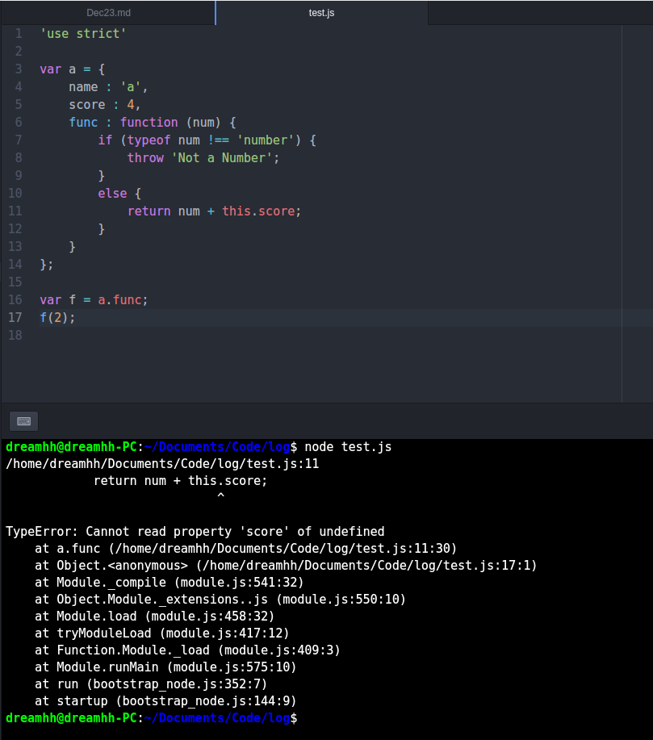

# JavaScript语法入门

Author: Dream_hh

Date: 2017-12-23

## 一、JavaScript是什么？

JavaScript是一门跨平台、面向对象的轻量级脚本语言，它是一门解释型语言。在早期的JavaScript是用在浏览器上的，后来随着发展可以在非浏览器的环境下运行，从而做到别的语言能做到的事，可以在Node.js环境下运行，Node.js也是现在服务器端的语言之一，但是由于发展时间还比较短所以并不像Java、PHP那样成熟。

JavaScript能做到很多事情，功能非常强大，比如它可以直接修改html和css文件，比如想在页面上添加元素，或者修改样式之类的。比如在chrome上的主题插件，原理大概就是利用JavaScript在页面的`<style>`元素中添加一些样式。

## 二、JavaScript基本语法

由于之前学过Python，JavaScript的语法和python有很多相似之处，所以这里不赘述太多，只写一些比较特别的。

### 1. 变量的声明

不像c，c++，java那些语言声明变量要特别说明数据类型，python直接就拿一个变量名来定义，而JavaScript变量名前要加`var`，比如：

```javascript
var x;
var y = 1;
var z = 'Hello, world!';
```

### 2. 数组

(1). JavaScript的数组与python列表相似，能存放不同数据类型。

```javascript
var a = [1, 2, 3, '3'];
```

(2). 如果直接修改`Array`的`length`属性可以改变数组的大小，如果大于当前`Array`长度，则多出来的元素为`undefined`，如果小于当前`Array`长度，则截断当前`Array`。

```javascript
var a = [1, 2, 3];
a.length = 5;   // a = [1, 2, 3, undefined, undefined]
a.length = 2;   // a = [1, 2]
```

(3). `Array`的`indexOf`方法类似于`c++`中的`string`的`find`方法，用于索引`Array`中的元素，返回第一个下标:

```javascript
> var a = [1, 2, 2, 3];
undefined
> a.indexOf(2);
1
```

(4). `slice`方法对应于python中的切片操作：

```javascript
> var a = [3, 2, 5, 1, 6];
undefined
> a.slice(2, 4);
[ 5, 1 ]
```

(5). `push`和`pop`方法，在结尾处添加和删除元素：

```javascript
> var a = [1, 2, 3];
undefined
> a.push('A', 'B');     // 注意到可以添加多个元素，按顺序添加
5       // 返回的是添加后的Array的长度
> a;
[ 1, 2, 3, 'A', 'B' ]
> a.pop();
'B'     // 返回删除的元素
> a;
[ 1, 2, 3, 'A' ]
```

(6). `unshift`和`shift`方法，与前连个相似，只不过是在`Array`头部添加和删除。

(7). `sort`方法，排序函数，按照升序排，测试的时候注意到可以对不同数据类型排，不过不知道是什么原理(或许有什么默认的优先级，比如`number`优先于`string`)，当然不推荐这种做法。值得注意的是JavaScript的`sort`方法是直接对`Array`本身直接修改，不像有些语言，返回的是排序后的副本，而原有`Array`并没有发生变化。举个例子：

```javascript
> var a = [5, 2, 4, 1, 2, 2];
undefined
> a.sort();
[ 1, 2, 2, 2, 4, 5 ]
> a;
[ 1, 2, 2, 2, 4, 5 ]
```

(8). `reverse`方法，将`Array`中的所有元素颠倒过来。一样是对`Array`本身进行修改，比较简单这里不举例。

(9). `splice`方法，它是修改`Array`的万能方法，可以从指定位置删除指定长度元素，并且添加若干元素。举例说明：

```javascript
> var a = [1, 2, 3];
undefined
> a.splice(1, 2, 'A', 'B', 'C');
// 第一个元素表示插入或删除位置
// 第二个元素表示删除的长度
// 第二个元素往后是要插入的所有元素
// 返回值是删除的元素
[ 2, 3 ]
> a;
[ 1, 'A', 'B', 'C' ]
> a.splice(2, 2);
// 删除２位置后的两个元素，并且不添加元素
> a.splice(2,2);
[ 'B', 'C' ]
> a;
[ 1, 'A' ]
> a.splice(0, 0, 'C', 'D');
// 不删除元素，添加两个元素
[]
> a;
[ 'C', 'D', 1, 'A' ]
```

(10). `concat`方法，拼接`Array`，类似于python中的`+`，它不会对调用对象本身进行修改，只是返回拼接结果：

```javascript
> var b = ['b'];
undefined
> var a = [1, 2, 3];
undefined
> a.concat(b);
[ 1, 2, 3, 'b' ]
> a
[ 1, 2, 3 ]
```

(11). `join`方法，将`Array`的元素全转成字符串，并且用参数中的字符串连接，默认的话使用`,`:

```javascript
> var a = [1,2,3];
undefined
> a.join();
'1,2,3'
> a.join('-');
'1-2-3'

```

(11). 多维数组，其实本质就是嵌套的`Array`。

### 3. 对象和方法

(1). JavaScript的对象定义非常简单，类似于python语言的字典，由多个键值对组成，但JavaScript中有更适合描述字典的Map，这个后面再讲，这里主要说明对象：


```javascript
var a = {
    name: 'Sam',
    birth: 1998,
    height: 1.80
};
```

访问对象的属性有两种方式：

```javascript
> a.name;
'Sam'
> a['name'];
'Sam'
```

可以注意到使用`[]`访问的时候用的是字符串，添加键值对的方法也很简单，直接赋值即可：

```javascript
> a.score = 5;
5
> a;
{ name: 'Sam', birth: 1970, height: 1.8, score: 5 }
> a['score'];
5
```

值得注意的是，对象的属性都应该是字符串，这点与python的字典不同，python的键可以是任何数据类型，当然JavaScript中的`Map`实现了完整的字典。

(2). 判断键是否在对象中，使用`in`：

```javascript
> 'name' in a;
true
```

但使用`in`是包含了继承的属性，如果判断是否为对象本身的属性，则使用`hasOwnProperty`方法：

```javascript
> 'toString' in a;
true        // ‘toString’是继承的方法
> a.hasOwnProperty('toString');
false
> a.hasOwnProperty('name');
true
```

(3). 方法，具体的函数定义可以看后面的函数部分。其实把函数本身就视为对象即可：

```javascript
> var a = {
    name: 'a',
    score: 4,
    func: function (num) {
        if (typeof num !== 'number') {
            throw 'Not a number';
        } else {
            return num + this.score;
        }
    }
   };
undefined
> a.name;
'a'
> a.func();
Not a number
> a.func(8);
12
```

也可以在对象外定义，然后再添加到对象中，可以注意到如果不是对象`a`调用的话，那么调用对象是`window`（针对浏览器的`console`环境，node下没有`window`）：

```javascript
> function getName() {
    return this.name;
    }
undefined
> a.getName = getName;
[Function: getName]
> a
{ name: 'a',
  score: 4,
  func: [Function],
  getName: [Function: getName] }
> a.getName();
'a'
> getName();
undefined
```

如果把对象的方法赋给另一个，如果不明确`this`，而且调用了方法后返回`NaN`（非`'use strict'`下，`this`指向`window`）:

```javascript
> var f = a.func;
undefined
> f();
Not a number
> f(2);
NaN
```

如果是在`'use strict'`下，`this`指向`undefined`，就会引发一个错误：



补充一下，如果在方法内部定义方法，内部方法如果用了`this`同样也是不明确`this`的指向。总而言之，在调用方法的时候始终要明确`this`指向哪个对象。

(4). `apply`方法，续上面方法中对`this`指向不明确的问题，`apply`方法用于自定义`this`的指向：

```javascript
function getName() {
    console.log(this.name);
}

var a = {
    name : 'a',
    score : 4,
    func : function (num) {
        if (typeof num !== 'number') {
            throw 'Not a Number';
        }
        else {
            return num + this.score;
        }
    },
    getAName : getName
};

a.getAName();
getName();
getName.apply(a, []);
```

放在node中运行：

```
dreamhh@dreamhh-PC:~/Documents/Code/log$ node test.js
a
undefined
a
```

`apply`由外部定义的函数对象调用，有两个参数，第一个参数是`this`的绑定对象，第二个参数是函数对象的参数列表，类型为`Array`，这个例子中无参数所以用`[]`。

还有一个`call`函数和`apply`相同，唯一的区别在于`apply`对参数打包，而`call`没有。

### 未完待续

后续内容点击查看Dec25.md。
