# CSS的伪类、层叠和布局

date: 2017-12-5

author: dreamgqk

-------

## 一、伪类

### 1. 什么是伪类

> 定义：CSS伪类是添加到选择器的关键字，指定要选择的元素的特殊状态。

> 语法：`selector:pseudo-class { property: value; }`

顾名思义，它看起来是类，但实际上不是类。用一个例子来引入**伪类**：我们平时在看网页的时候，通常会看到那些链接会根据不同的状态有不同的表现，比如还没点击的时候，它可能是蓝色的，当把鼠标悬停在上方的时候，可能变成橙色，如果你以前点过这个链接，那它可能是紫色。根据我们以前所学的CSS知识不足以去解决这样的问题，这是只是一个标签却有不同的状态，接下来我们用伪类来解决。

### 2. 用法

继续说刚刚的例子，我们刚刚列举了链接的3种状态：

- 未访问
- 悬停
- 已访问

按照我们以前的做法，如果想写它的样式，可以把它放到一个类里，现在我们把它们看做是不同的，只需要在它们的选择器后添加上伪类名，看一个简单的例子：

```css
a:link {
    /*表示未访问的链接*/
    color: #007e7e;
    text-decoration: dashed underline;
}

a:visited {
    /*已访问的链接*/
    color: #333333;
}

a:hover {
    /*悬停状态的链接*/
    background: #f88396;
    color: #0d5353;
}
```

显示效果：

- 未访问状态(`:link`)：

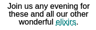

- 已访问状态(`:visited`)：

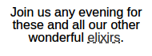

- 悬停状态(`:hover`):

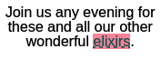

### 3. 伪类索引

伪类不止针对`<a>`元素，很有很多其他的使用，比较多这里就不一一例举，关于有哪些伪类提供一个链接[标准伪类索引](https://developer.mozilla.org/zh-CN/docs/Web/CSS/Pseudo-classes#标准伪类索引)，当然标准也会变的，前端又发展地如此快，总之遇到不懂的就多查多测试。

## 二、层叠

### 1. 层叠的含义

我们知道CSS中的"C"是"Cascading"，即**层叠**。如何理解这个“层叠”？前面我们知道，对一个元素可能被多个选择器选择，就像多个样式叠加在这个元素上，当发生冲突的时候会选择优先级比较高的，这就是层叠的含义了。

首先我们需要知道，用在元素上的样式其实是有3个来源的：

- 程序员：首先给所有页面写样式表的人
- 用户：有些浏览器允许用户为HTML创建自己的样式，如果程序员没有为某个元素写样式，用户就可以为这个元素写。
- 浏览器：如果前两者都没有为某元素写样式，那么这个元素就会采取浏览器默认的样式。

优先级在正常情况下是从上到下，但也有**例外**，比如用户在自己写的样式表的一个属性声明后加上`!important`，这样就能覆盖程序员写的样式。

### 2. 层叠的步骤

1. 收集所有的样式表：包括程序员写的、用户增加的、浏览器默认的。

2. 找到所有匹配的属性声明：比如想找`<p>`的`font-size`属性，就会把所有可能的规则全都找出来。

3. 对所有匹配的规则排序：程序员的样式表 > 用户增加的样式表 > 浏览器默认的。

4. 按照特定性进行排序：特定性可以量化，稍后会讲，注意这里的排序是分3块排序，即程序员的样式表、用户增加的样式表和浏览器默认的样式表，这3者的优先级是不会变的(除了`!important`)，比如程序员所写的样式表特定性大于用户的。

5. 特定性相同的规则，也就是所谓冲突的规则，按照它们各自在样式表中出现的规则进行排序。

这里有一点要特别说明，前面学混合样式表的时候多个`<link>`引入多样式表时，其实可以把它们整合起来看成一个样式表，然后进行上面的步骤。

### 3. 计算特定性（优先级）

详情参考[优先级如何计算](https://developer.mozilla.org/zh-CN/docs/Web/CSS/Specificity)。

设置一个3位数，初始为**000**。

3.1. 如果选择器包含`id`，最高位+1，即**100**。

3.2. 如果包含类或者伪类，则第二位+1，即**010**。

3.3. 这个选择器每包含一个元素名，最低位+1，即**001**。

比如：

选择器|特定性
-----|-----
h1.greentea|011
ol li p|003
a:link|011
#elixirs h1|101
#exam|100

## 三、布局

我们之前的CSS只是写盒子内部是什么样式，顶多就是改变下内外边距来影响一下位置，但目前为止的网页只能从上到下这样排下来，现在学习一些属性和方法来修改元素的位置，专业的讲这叫**布局**。这里说4中布局，每个布局都有各自的优缺点，通常在一个页面中可能采取多种布局，因为同一种布局的方式是不唯一的。

### 1. 流

在开始布局前，首先需要知道浏览器是如何把HTML文档的各个部分呈现在页面上。如果我们什么css都没添加，或者说没有一些改变元素位置的属性，那么各元素在页面上呈现出来的顺序：块元素从上到下，顺序跟在HTML文档中的一样，内联元素从左到右，碰到所在容器边界就换行，这些元素就像水一样依次“流”进页面中，这就是 **文档流(normal flow)**（或者叫**正常流**）。

另外补充2个小知识：

- 浏览器并排放两个内联元素的时候，两个元素边框之间的空间等于两个外边距的和。

- 浏览器上下放置两个块元素的时候，两个元素边框之间的外边距发生折叠，会选取两者之间较大的一个，相等时就取这个相等的值。

### 2. 浮动布局

主要是靠`float`属性，具体见[float CSS](https://developer.mozilla.org/zh-CN/docs/CSS/float)。

`float`属性有什么作用？它能让元素脱离文档流（脱离文档流的意思是文档流中的元素会“看不见”它），并且浮动到左边或右边，它虽然脱离文档流，但是内联元素（包括文本Text）围绕它。这是它的特点。浮的高度取决于它在HTML文档中的位置，HTML文档中元素的顺序对它在页面中显示非常重要。

同时使用`float`浮动的元素，必须要设置特定的宽度(`width`)，这很好理解，如果不设置的话，它左右延伸整个页面，就会感觉它并没有脱离文档流，因为那些内联元素依然会绕开它。

接下来看如何使用`float`。

比如说有这样一段HTML(`div`标签的内容太长所以收起来了，只要知道它是一个边栏):

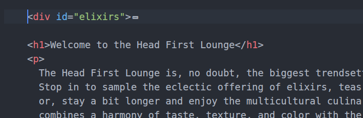

显示效果如下：

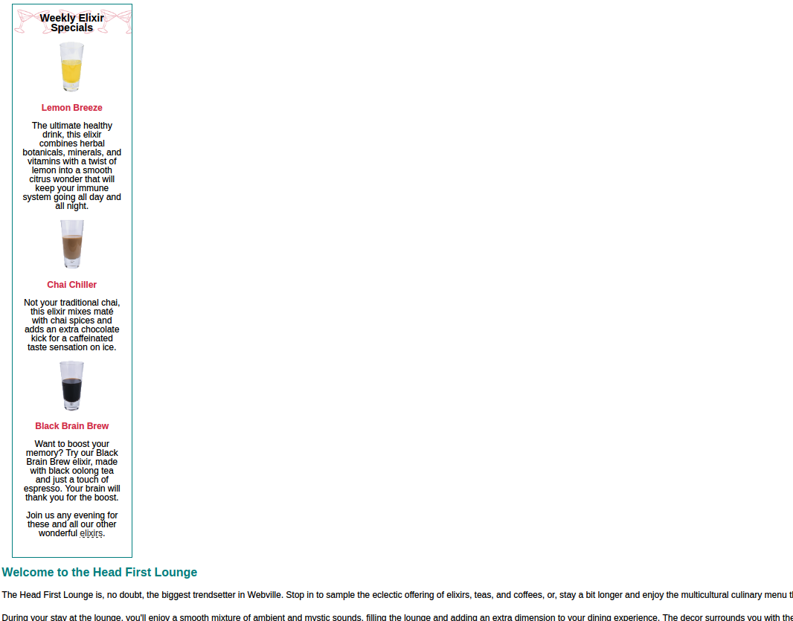

我想把边栏放到右边，添加`float`属性：

```css
#elixirs {
    line-height: 1;
    border: thin solid #007e7e;
    width: 200px;
    padding: 0px 20px 20px 20px;
    margin-left: 20px;
    text-align: center;
    background: white url(images/cocktail.gif) repeat-x;
    float: right;
}
```

效果如图：

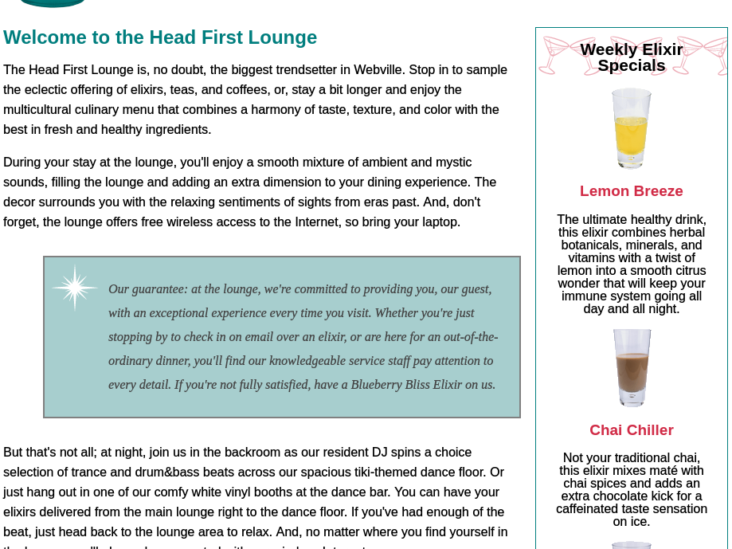

可以看到，文本和内联元素都会绕开它，那个青色背景的块元素不是绕开它，而是因为它的`margin-right`足够大。如果我不希望下面的元素绕开它，而是直接在浮动的元素的下方，可以用`clear`属性，它的作用是保证左边或右边或左右都没有浮动元素。用法如`clear: right;`(右边没有浮动元素)、`clear: both;`(两边都没有浮动元素)。这样就可以回避块元素和浮动元素重合的问题。

比如添加`clear`之前：

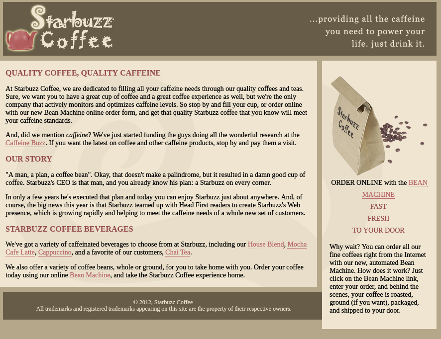

你可以看到最下面的块元素和右边的浮动元素发生了重叠。如果我在最下面的元素的选择器中这么写：

```css
footer {
    ...
    clear: right;
}
```
那么效果就是这样的：

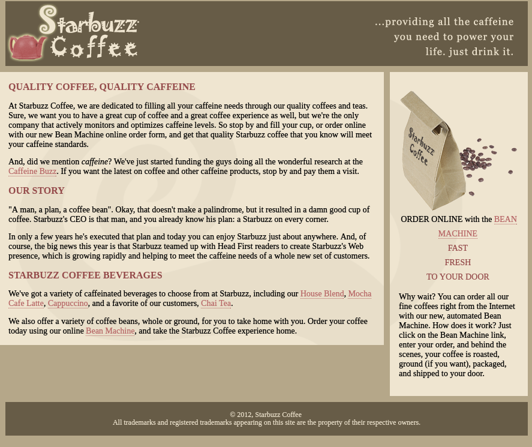


它也是优缺点的，比如你不得不通过改变元素在HTML中的位置来改变它在页面中的位置，这样如果失去了CSS可能会让人觉得很混乱，因为你把边栏（一般来说没有主体信息重要）放在了主体信息之前。

### 3. 凝胶布局

讲凝胶布局前应该现说冻结。我们可以看到当页面可缩放的时候，那些没有限定宽度的元素就会自动变宽以填满左右的空间，从而使得下面的块元素朝上移动而和浮动元素可能发生重合。这可能不是我们所希望看到的，所以我们一般会对一些标签“冻结”，限定他们的宽度让他们不能随着页面缩放而改变宽度。比如上面那个Starbuzz网页的例子，如果我不对它进行冻结，页面变宽后就会：

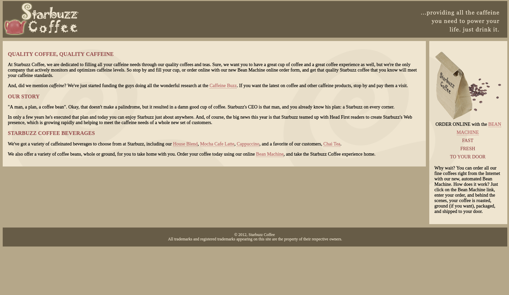

其实要把它们冻结起来非常简单，放到一个`<div>`下然后限制宽度就好了。比如我限制宽度：

```html
<body>
    <div id="frozen">
        ...
    </div>
</body>
```

用一个`<div>`包含整个页面。

```css
#frozen {
    width: 800px;
}
```

效果如下：

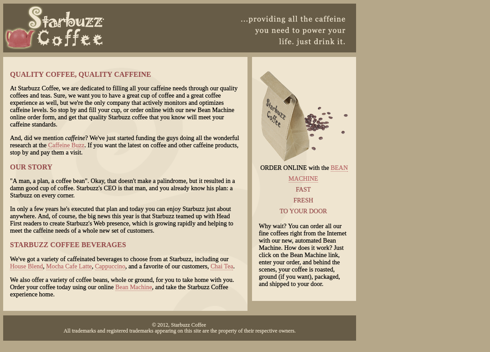

是不是不太完美呢？接下来就是所谓的**凝胶布局**了，其实原理也非常简单，通过改变外边距来控制他在页面中的位置。一般来说我们可能希望整个主体部分居中，而且页面缩放后依然能在中间。可以设置为`auto`:

```css
#frozen {
    width: 800px;
    margin-left: auto;
    margin-right: auto;
}
```

效果如下：

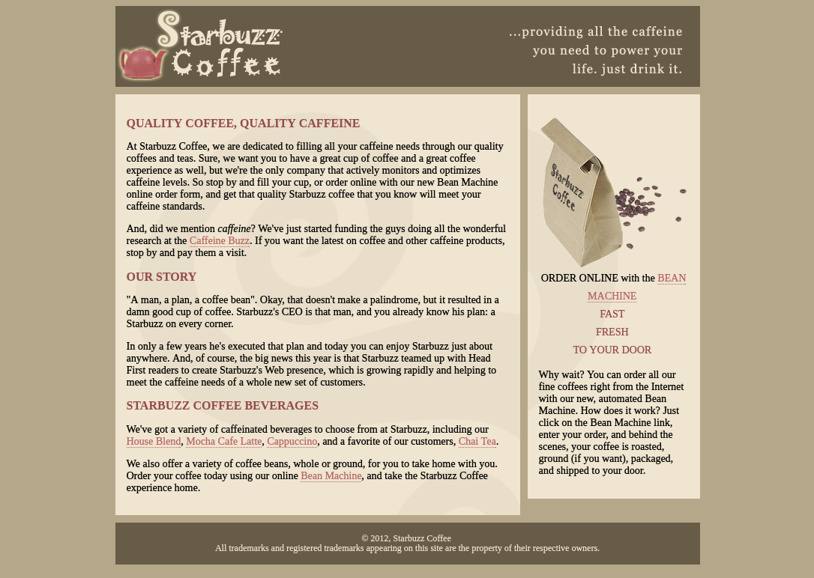

这样看上去就相对完美了。这种冻结整体或部分整体的思想应该具备。

### 4. 绝对布局

利用`position`属性和一些位置属性来实现在页面上的精准定位。还是老惯例，我向来不会保证自己现在写的以后依然还看得懂，所以我选择提供链接...[CSS 定位](https://developer.mozilla.org/zh-CN/docs/Learn/CSS/CSS_layout/%E5%AE%9A%E4%BD%8D)。

我们不需要再像前面浮动布局那样修改元素在HTML中的位置来达到我们想要的效果，对于绝对布局来说，它无需理会元素在HTML中的位置，它做的只是告诉浏览器这个元素该准确地放在哪里。

这样的话我们的控制权就更大了，但一个布局总会有它的优缺点，绝对布局其实也是把元素从文档流中抽取出来，但它比浮动元素更彻底，因为内联元素或者文本好歹会绕开浮动元素，但绝对定位的元素就不一样了，连内联元素都看不见。把网页想象成平面的话，绝对定位元素其实是在页面之上的（已经跟文档流中的元素不在一层上了），所以它会覆盖在它下面的元素。所以如果你不想让文档流中的元素被覆盖，可能需要一点小计算。

事实上绝对定位元素之间也是存在这分层的，依靠`z-index`来决定，它的值是整数，可正可负，唯一的规则是，数越大的层越高。

首先看下`position`属性的值：

属性值|含义
-----|----
`static`|静态定位，即在文档流中，默认的值
`absolute`|绝对定位，在网页中的位置是确定的
`fixed`|固定定位，在页面中的位置固定，即滚动页面的时候它不会改变
`relative`|相对定位，首先先按和文档流一样正常流入页面，然后显示前进行相对偏移

然后下来要通过`top`、`bottom`、`left`、`right`属性指定元素的位置，可以是像素值（与页面边界的距离）实现精准定位，也可以是百分数，比如页面宽度是800px，那么`left: 10%;`就相当于`left: 80px;`，当然它会随着页面大小的变化而变化。举个例子，比如添加了一张图片(`id="award"`)：

```css
#award {
    position: absolute;
    top: 30px;
    left: 30px;
}
```

显示效果：

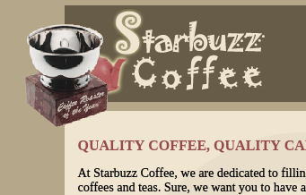

当然也可以修改`left: 45%;`，这样显示出来就比较靠中间了：

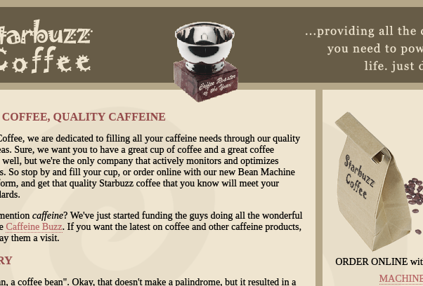

`fixed`和`relative`也比较容易，可以根据文档测试，这里就不多说。

### 5. CSS表格显示布局

如果需要建立多栏布局（即可以把各部分内容看成几行几列），并且内容栏是均匀的，就可以用表格布局。

其实原理非常简单，我们把`<div>`元素看成是容器，那样可以把每一行放到一个`<div>`里，每一行中又有列，再把每一列的元素按顺序放就可以了，最后把所有行丢到一个`<div>`里表示整个表格，再用`display`属性。还是以刚刚那个界面为例子：

```html
<div id="tableContainer">
    <div id="tableRow">

        <section id="main">...</section>

        <aside>...</aside>

    </div>
</div>
```

这是一行两列的表达方式。然后添加CSS:

```css
div#tableContainer {
    display: table;
    border-spacing: 10px;
}

div#tableRow {
    display: table-row;
}

#main {
    display: table-cell;
    background: #efe5d0 url(images/background.gif) top left;
    font-size: 105%;
    padding: 15px;
    vertical-align: top;
}

aside {
    display: table-cell;
    background: #efe5d0 url(images/background.gif) bottom right;
    font-size: 105%;
    padding: 15px;
    vertical-align: top;
}
```

`display`属性指定元素呈现框的类型，这里的`display: table;`是指按照块级表格显示，`table-row`表示作为表格行显示，`table-cell`表示作为表格单元格显示（更多相关内容查看[display](https://developer.mozilla.org/zh-CN/docs/Web/CSS/display)）。

`vertical-align: top;`会让单元格之间的内容向上对齐。

`border-spacing`让表格中的单元格增加10px，但要注意它创造的这个距离和外边距的空间不会折叠，比如上面这些属性产生的效果，显然注意到中间的表格和上下元素之间的空间不止10px：

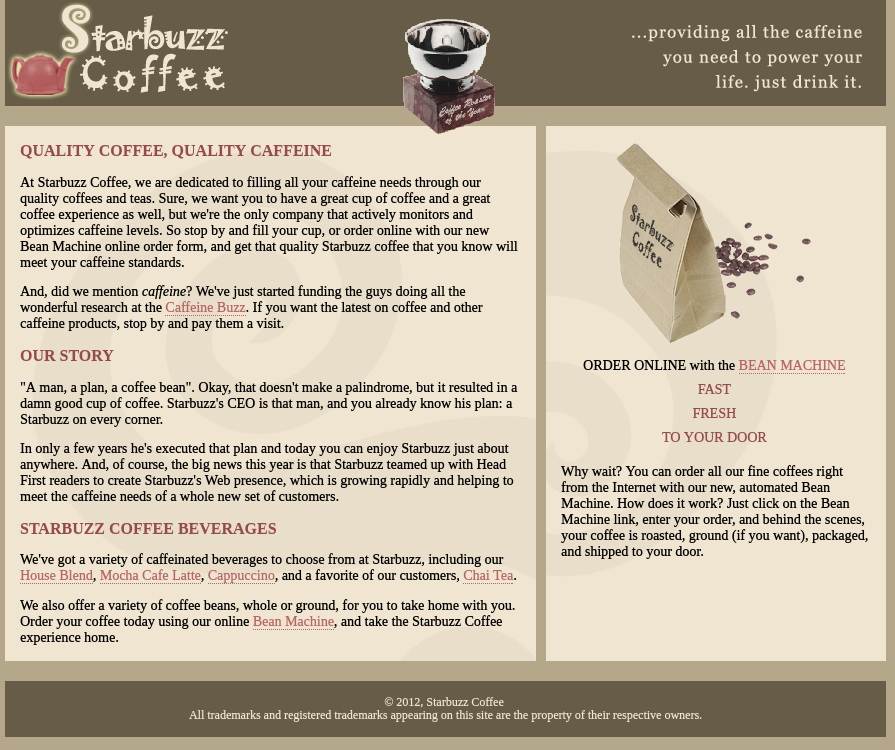

比较容易的处理方法就是去掉上下元素和表格之间的外边距，修改CSS后的显示效果：


还存在着更多的布局方式，继续学习。
