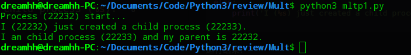
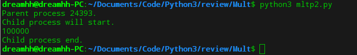
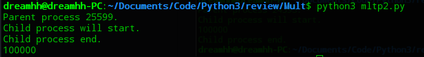
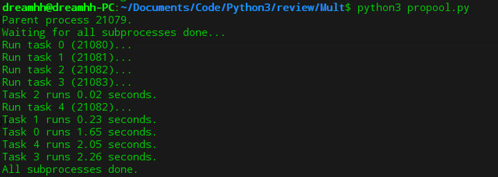
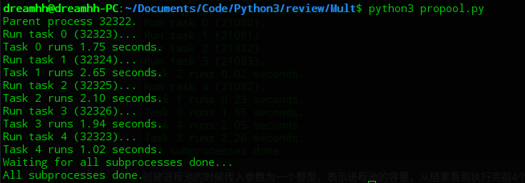

# python多进程

## 一、`fork()`函数

`fork()`函数在Python的`os`模块中，可以在Python程序中轻松创建子进程，它有两个返回值，因为操作系统会把当前进程fork出一份子进程，然后分别在父进程和子进程内返回，父进程返回子进程的ID，子进程返回`0`：

```python
import os

print('Process (%s) start...' % (os.getpid()))

pid = os.fork()
if pid == 0:
    print('I am child process (%s) and my parent is %s.' % (os.getpid(), os.getppid()))
else:
    print('I (%s) just created a child process (%s).' % (os.getpid(), pid))
```

运行结果：



可以看到父进程先返回子进程的ID，再由子进程返回`0`。

## 二、`multiprocessing`模块

`fork()`函数只能在Unix/Linux环境下运行，在Windows下没有，为了能够跨平台，可以使用`multiprocessing`模块方便而快捷地实现多进程。下面记录了常用的对象和API。

### 1. `Process`对象

一个`Process`对象就是一个进程，在父进程里可以创建多个`Process`对象来实现多进程，下面创建一个子进程为例：

```python
from multiprocessing import Process
import os

def run_proc(name):
    result = 0
    for each in range(100000):
        result = result + 1
    print(result)

if __name__ == '__main__':
    print('Parent process %s.' % os.getpid())
    p = Process(target=run_proc, args=('test',))
    print('Child process will start.')
    p.start()
    p.join()
    print('Child process end.')
```

运行结果：



实例化一个`Process`对象，`target`参数后面接要执行的子进程（函数），`args`接收要传给目标函数的参数，注意是**元组**。`start()`方法表示子进程开始。

而`join()`方法表示当前进程结束后才能执行下一个进程，也就是进程间的同步。如果注释掉上述代码的`join()`方法，运行结果如下：



注意到子进程还未结束，父进程的下一条语句就执行了，也就是异步执行多进程。

### 2. `Pool`对象

有的时候我们需要启动大量的进程，比如可能同时进行多个相似的任务，可以采用`Pool`对象，即进程池：

```python
from multiprocessing import Pool
import os, time, random

def long_time_task(name):
    print('Run task %s (%s)...' % (name, os.getpid()))
    start = time.time()
    time.sleep(random.random() * 3)
    end = time.time()
    print('Task %s runs %0.2f seconds.' % (name, (end - start)))

if __name__ == '__main__':
    print('Parent process %s.' % os.getpid())
    p = Pool(4)
    for i in range(5):
        p.apply_async(long_time_task, args=(i,))
    print('Waiting for all subprocesses done...')
    p.close()
    p.join()
    print('All subprocesses done.')
```

运行结果：



创建进程池的时候传入参数为一个整型，表示进程池的容量，从结果看到执行完前4个进程后才开始继续添加进程。

添加进程的方法是`apply_async()`，第一个参数是子进程（函数），第二个参数是传递给子进程的参数元组。`apply_async()`添加的进程是非阻塞的（异步执行），另一种方法是`apply()`，它是阻塞的（同步执行）。将添加进程的代码换成

```python
for i in range(5):
    p.apply(long_time_task, args=(i,))
```

运行结果就变为：



`close()`方法用来关闭进程池，关闭的进程池无法再添加进程。只有使用了`close()`方法才能使用`join()`方法。
